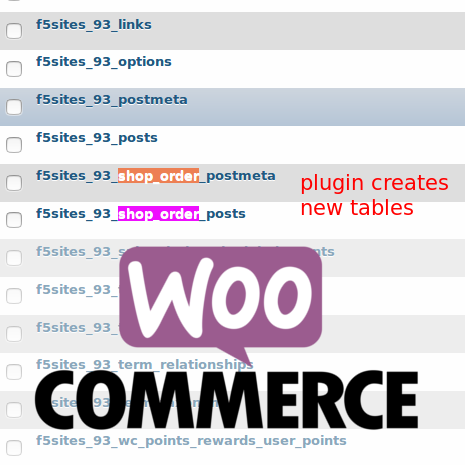

# F5 Sites WooCommerce shop_orders Tables
by Francisco Mat

Hack plugin to make WordPress painless synching server instances database (aka: dev and production)



bunch update on WOOCOMMERCE core for FNETWORK COMPATIBILITY

==First: wpsql wordpress mysql plugin manager
We drasticly change the way we automate wp backup, so all order are stored separed in it own datastructure. All order are prefixed with 6woo_, so the table structure for orders are:

```
* 6woo_PREFIX_shop_order_post
* 6woo_PREFIX_shop_order_postmeta
* 6woo_PREFIX_woocommerce_order_items
* 6woo_PREFIX_woocommerce_order_itemmeta
```

In that way, to backup order from remote server, all we need to do is simples run

wpsql --import-prefixed 6woo_PREFIX

These was fundamental for speeding-up data backup and automatized backup process

== Modifications
inserted hook on wc_get_order e  wc_get_orders, and hook woocommerce_checkout_update_order_review, so the POST OBJECT from orders (integrated with F5 Sites WooCommerce shop_orders Table)

```
#Gracefull integration, it need manual update on WOO core
add_action("get_orders_F5SITES_inserted_hook", "force_new_names_AKA", 10, 2);//for users on front-end
add_action("order_received_F5SITES_inserted_hook", "force_new_names_AKA", 10, 2);
add_action("woocommerce_before_checkout_process", "force_new_names_AKA", 10, 2);
add_action("wc_frontend_scripts", "revert_database_schema_after_get_order", 5, 2);
```

And for ITEMS and ITEMSMETA the hack was more precisly on core, find and replacing

```
$wpdb->prefix."woocommerce_order_items"
$wpdb->prefix . "woocommerce_order_items"
$wpdb->prefix."woocommerce_order_itemmeta"
$wpdb->prefix . "woocommerce_order_itemmeta"
$wpdb->prefix.'woocommerce_order_items'
$wpdb->prefix . 'woocommerce_order_items'
$wpdb->prefix.'woocommerce_order_itemmeta'
$wpdb->prefix . 'woocommerce_order_itemmeta'
{$wpdb->prefix}woocommerce_order_items
{$wpdb->prefix}woocommerce_order_itemmeta
```

to include 6woo_ before all of it, replacing core code...note best solution I know